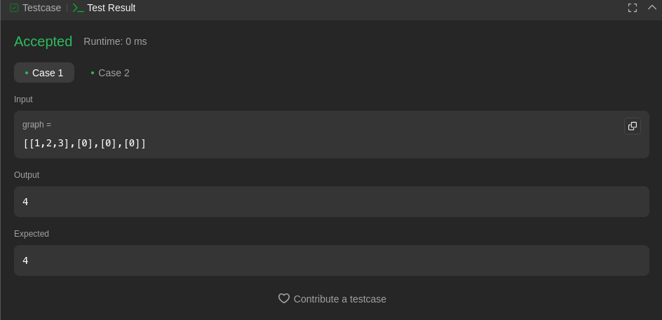
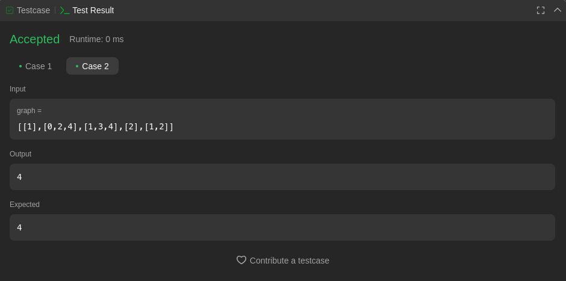
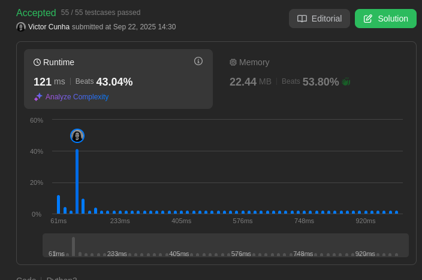
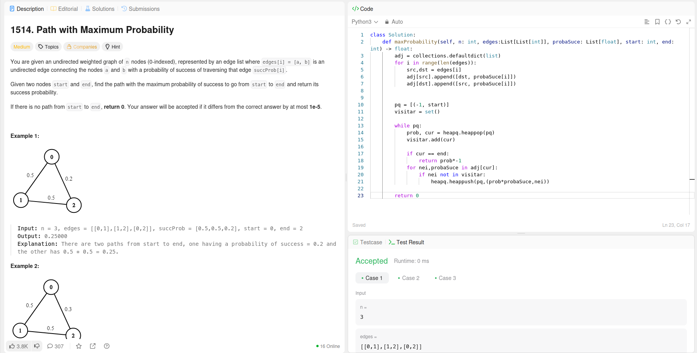
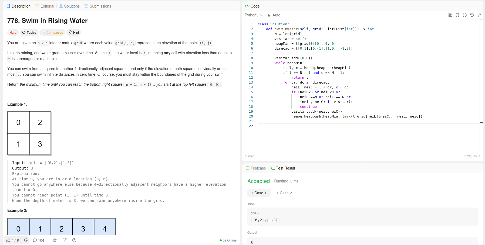

# Grafos2-Dupla-55

Temas:
 - Grafos2

**Número da Lista**: 2<br>
**Conteúdo da Disciplina**: Grafos 2<br>

## Alunos
|Matrícula | Aluno |
| -- | -- |
| 21/1031520 |  Victor Hugo da Cunha Santos |
| 23/1037665 |  Daniel Rodrigues Nascimento |

## Sobre 
Resolução de exercícios do CodeForces/LeetCode/AtCoder/HackerRank de acordo com as condições
propostas pelo professor em sala de aula.


## Exercícios
|Exercício | Resolução | Dificuldade |
| -- | -- | -- |
[847-ShortestPathVisitingAllNodes](https://leetcode.com/problems/shortest-path-visiting-all-nodes/description/) | [ShortestPathVisitingAllNodes.py](https://github.com/projeto-de-algoritmos-2025/Grafos1-D55/tree/main/ShortestPathVisitingAllNodes.py) | Difícil |
| [MaxProbability](https://leetcode.com/problems/path-with-maximum-probability/) | [MaximumProbability.py](https://github.com/projeto-de-algoritmos-2025/Grafos2-D55/tree/main/MaximumProbability.py) |Média |
| [SwimWater](https://leetcode.com/problems/swim-in-rising-water/description/) | [SwimWater.py](https://github.com/projeto-de-algoritmos-2025/Grafos2-D55/tree/main/SwimWater.py) |Difícil |


## Vídeo
|Vídeo de explicação|
|--|
| [Clique aqui](https://youtu.be/z4eV3gtIdw8) |


## Screenshots
- *ShortestPathVisitingAllNodes*
<div align="center">
	
</div>
<div align="center">
	
</div>
<div align="center">
	
</div>

- *MaxProbability*
<div align="center">
    
</div>

- *SwimWater*
<div align="center">
    
</div>

## Instalação 
**Linguagem**: <br>
- Python

## Uso 
- Ter o Python 3 instalado na máquina
- Para rodar a resolução do exercício BFSShortestReach:

```bash
python nome_do_arquivo.py
```

## Outros 
Quaisquer outras informações sobre seu projeto podem ser descritas abaixo.
